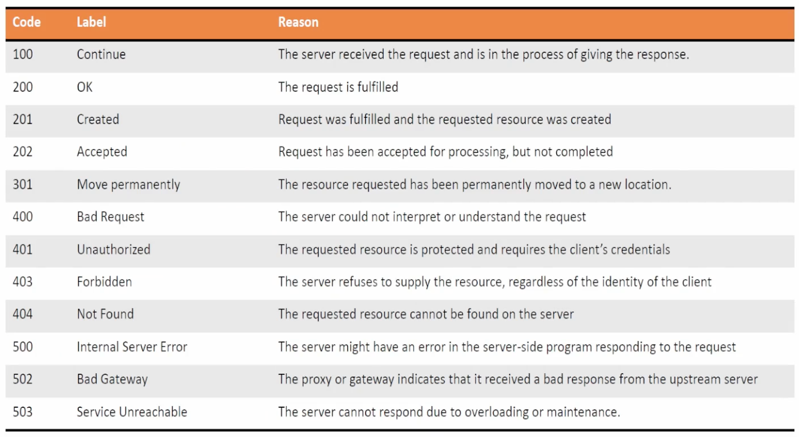

- [1.0 Network Programmability Foundation](#10-network-programmability-foundation)
  - [1.2/1.3 API](#1213-api)
  - [Python](#python)
  - [1.6 Tools](#16-tools)
    - [long-running tasks](#long-running-tasks)
- [2.0 Automate APIs and Protocols](#20-automate-apis-and-protocols)
  - [YANG modules](#yang-modules)
    - [Example](#example)
    - [OpenConfig vs IETF vs Native](#openconfig-vs-ietf-vs-native)
    - [Resources](#resources)
- [3.0 Network Device Programmability](#30-network-device-programmability)
  - [3.1 Netmiko](#31-netmiko)
    - [commonly used calls](#commonly-used-calls)
  - [3.2 ncclient + NETCONF](#32-ncclient--netconf)
  - [3.4 Ansible](#34-ansible)
    - [inventory](#inventory)
    - [task](#task)
  - [3.5-3.7 Model Driven Telemetry (MDT)](#35-37-model-driven-telemetry-mdt)
    - [CLI](#cli)
    - [RESTCONF](#restconf)
    - [NETCONF](#netconf)
    - [more readings](#more-readings)

* from orhanergun @ udemy
  * https://github.com/OrhanErgun-net/OE_ENAUTO_300435

# 1.0 Network Programmability Foundation

## 1.2/1.3 API

* 1.2 Describe characteristics of API styles (REST and RPC)
* 1.3 Describe the challenges encountered and patterns used when consuming APIs synchronously and asynchronously


* POST: CREATE
* PUT: UPDATE:replace
* PATCH: UPDATE:append


## Python

* [cheat notes](./python.md)

## 1.6 Tools

* 1.6 Explain the benefits of using network configuration tools such as Ansible and Terraform for automating IOS XE platforms
* Ansible
  * Agent-less, Push, Procedural
  * More popular
* Puppet/Chef
  * Agent-based, Pull, Declarative

### long-running tasks

* Puppet (Agent-Based, Declarative Model)
  * Puppet operates on a pull-based model where agents periodically check in with the Puppet server.
  * If a task takes too long:
    * Puppet runs have a default timeout (e.g., 1800 seconds for an agent run).
    * If the timeout is exceeded, the agent run will fail, and Puppet will try again in the next scheduled run.
    * Long-running tasks should ideally be handled outside Puppet, using a system service or scheduled job (e.g., a systemd service or cron job).
    * Workarounds:
      * Use exec resources carefully with timeout parameters.
      * Offload long tasks to a separate background process.
* Ansible (Agentless, Push-Based Model)
  * Ansible executes tasks sequentially and synchronously by default.
  * If a task takes too long:
    * The SSH connection may time out (`ansible_ssh_timeout` setting).
    * If async and poll are not set, Ansible waits for task completion before proceeding.
    * Solutions:
      * `Async` Mode: Run tasks asynchronously using async and poll:
      ```yaml
      - name: Run a long task asynchronously
        command: /path/to/long_task.sh
        async: 3600   # Run for up to 1 hour
        poll: 10      # Check every 10 seconds
      ```
      * Fire and Forget: Set `poll: 0` to start the task but not wait for completion.
      * Check Status Later: Use `async_status` to check the task status later.

# 2.0 Automate APIs and Protocols

* 2.1 Identify the JSON instance based on a YANG model (including YANG Suite)
* 2.2 Identify the XML instance based on a YANG model (including YANG Suite)
* 2.3 Interpret a YANG module tree generated per RFC8340
* 2.4 Compare functionality, benefits, and uses of OpenConfig, IETF, and native YANG models
* 2.5 Compare functionality, benefits, and uses of NETCONF and RESTCONF
  * netconf: ssh port 830 (RFC 6242)

## YANG modules

* Data modeling = fillable forms at clinic
* RFC 8340
* github.com/YangModels/yang
* Tree Diagram
  * all elements are defined in the tree
    * nodes
      * leaf
      * list
      * leaf-list
    * containers
      * number of nodes
    * grouping
      * a set of elements
      * can be referred later
    * augmentations
      * insert new elements

### Example

```yang
module example-interface {
  namespace "urn:example:interface";
  prefix "intf";

  organization "Example Inc.";
  contact "support@example.com";
  description "A simple YANG model for network interfaces.";

  revision "2025-03-05" {
    description "Initial version";
  }

  container interfaces {
    list interface {
      key "name";
      
      leaf name {
        type string;
        description "Interface name (e.g., eth0, GigabitEthernet1)";
      }

      leaf enabled {
        type boolean;
        default "true";
        description "Enable or disable the interface.";
      }

      leaf ip-address {
        type string;
        description "IPv4 address assigned to the interface.";
      }
    }
  }
}
```

* REST API to config an interface

```json
PUT /restconf/data/interfaces/interface=GigabitEthernet1
Host: network-device.example.com
Content-Type: application/yang-data+json
Authorization: Bearer <your-token>

{
  "interface": {
    "name": "GigabitEthernet1",
    "enabled": true,
    "ip-address": "192.168.1.1"
  }
}
```

### OpenConfig vs IETF vs Native


| **Criteria**               | **OpenConfig**                          | **IETF**                               | **Native YANG Models**                     |
|----------------------------|-----------------------------------------|----------------------------------------|--------------------------------------------|
| **Origin**                 | Developed by network operators (e.g., Google, Facebook) | Developed by IETF, based on RFCs       | Developed by individual vendors           |
| **Scope**                  | Vendor-neutral, multi-vendor support    | Core network protocols (standardized)  | Vendor-specific, proprietary features     |
| **Functionality**          | Focus on operational efficiency, telemetry, and automation | Covers basic network protocols (e.g., routing, IP, etc.) | Device-specific, supports proprietary configurations |
| **Benefits**               | Vendor-neutral, extensible, community-driven | Industry-standard, interoperability, scalability | Tailored to vendor-specific features, fully supported |
| **Use Cases**              | Data centers, large operator networks, multi-vendor environments | Core network management, standard protocols | Vendor-specific environments, advanced configurations |

### Resources

* https://github.com/CiscoDevNet/yangsuite
* [YANG Suite - Cisco Learning Lab](https://developer.cisco.com/learning/labs/intro-yangsuite/introduction-launching-yang-suite/)
  * to load models, interact with elements, create RESTCONF urls, etc.
* https://www.yangcatalog.org/yang-search
  * search YANG models

# 3.0 Network Device Programmability

## 3.1 Netmiko

* 3.1 Implement device management and monitoring using NetMiko

```python
from netmiko import ConnectHandler
  
# Device details
cisco_device = {
    "device_type": "cisco_ios",
    "host": "10.10.0.2",  # Replace with your device's IP
    "username": "noc",
    "password": "cisco",
}

# Connect to the device
net_connect = ConnectHandler(**cisco_device)
net_connect.enable()  # Enter privileged EXEC mode

# Send configuration commands
config_commands = [
    "interface lo1",
    "description Configured via Netmiko",
    "ip address 192.168.1.100 255.255.255.0",
]
output = net_connect.send_config_set(config_commands)

# Print command output
print(output)

# Verify changes
print(net_connect.send_command("show ip interface brief"))

# Disconnect from device
net_connect.disconnect()
```

* log from router

```
*Mar 12 14:45:52.709: %SEC_LOGIN-5-LOGIN_SUCCESS: Login Success [user: noc] [Source: 10.10.0.1] [localport: 22] at 14:4
5:52 UTC Wed Mar 12 2025
*Mar 12 14:45:53.131: %LINEPROTO-5-UPDOWN: Line protocol on Interface Loopback1, changed state to up
*Mar 12 14:45:53.408: %SYS-5-CONFIG_I: Configured from console by noc on vty0 (10.10.0.1)
```

### commonly used calls

* Netmiko simplifies network device interaction via SSH. It offers several functions for sending commands and retrieving output:

| Command                          | Description |
|----------------------------------|-------------|
| `send_command()`                 | Sends a single command and returns the output, often used to retrieve information from the device rather than configure it. It automatically handles command echoing and prompt stripping. |
| `send_command_timing()`          | Sends a command and waits for output based on a timer. It is useful when dealing with commands that take a longer time to execute. |
| `send_config_set()`              | Executes multiple configuration commands. It automatically enters configuration mode and applies the commands. |
| `send_config_from_file()`        | Reads configuration commands from a file and executes them using `send_config_set()`. |
| `read_channel()` and `write_channel()` | Useful for connecting through jump hosts, providing low-level control over data transmission. |
| `enable()`                       | Enters enable mode. |
| `check_enable_mode()`            | Checks if the device is in enable mode. |
| `exit_enable_mode()`             | Exits enable mode. |
| `find_prompt()`                  | Finds the current prompt. |
| `disconnect()`                   | Disconnects from the device. |


## 3.2 ncclient + NETCONF

* 3.2 Construct a Python script using ncclient that uses NETCONF to manage and monitor an IOS XE device

```python
from ncclient import manager
import xml.etree.ElementTree as ET

# Device details
cisco_device = {
    "host": "10.10.0.2",  # Replace with your device's IP
    "port": 830,
    "username": "noc",
    "password": "cisco",
    "hostkey_verify": False,
}

interface_filter = """
<filter>
    <interfaces xmlns="urn:ietf:params:xml:ns:yang:ietf-interfaces">
        <interface/>
    </interfaces>
</filter>
"""

# Connect to the device
with manager.connect(**cisco_device) as m:
    c = m.get_config(source="running").data_xml
    with open(f"{cisco_device['host']}.xml", "w") as f:
        f.write(c)

    intf = m.get_config(source="running", filter=interface_filter)
    print(intf)

    root=ET.fromstring(intf.xml)
    ns = {"if": "urn:ietf:params:xml:ns:yang:ietf-interfaces"}

    for i in root.findall(".//if:interface/if:name", ns):
        print(f"interface: {i.text}")

```

* 3.3 Configure device using RESTCONF API utilizing Python requests library

## 3.4 Ansible

* 3.4 Utilize Ansible to configure an IOS XE device

### inventory

```yaml
lab0_blades:
  hosts:
    mem[1:8]:
blades:
  children:
    lab0_blades
nbd_servers:
  children:
    lab0_blades
```

* each group can have different vars

```
lab git:(main) ls -l group_vars 
total 20
-rw-rw-r-- 1 xzhao xzhao 683 Sep 14 16:51 all.yml
-rw-rw-r-- 1 xzhao xzhao 299 Sep 14 16:51 blades.yml
-rw-rw-r-- 1 xzhao xzhao  18 Nov 27  2023 nbd_servers.yml
```

### task

* main task file includes subtasks

```yaml
- hosts: lab0_blades
  environment:
    GIT_SSL_NO_VERIFY: 'true'
  tasks:
  - include_tasks: tasks/common/hosts.yml
  - include_tasks: tasks/common/docker.yml
  - include_tasks: tasks/blades/telegraf.yml
```

* subtasks

```yaml
- name: Update the /etc/netplan/99-config.yaml file
  lineinfile:
    path: "/etc/netplan/99-config.yaml"
    line: "    enp24s0f1np1:"
    regexp: "^[ ]+enp24s0f0np0:$"
  become: yes

- name: apply changes
  command: "netplan apply"
  become: yes
  register: netplan

- name: debug
  debug:
    msg: "{{ netplan.stdout_lines }}"
  tags:
  - debug
```

* run ansible

```
ansible-playbook --vault-id .key blades.yml -i inventories/lab/blades
```

## 3.5-3.7 Model Driven Telemetry (MDT)

* 3.5 Configure a subscription for model driven telemetry on an IOS XE device (CLI, NETCONF, and RESTCONF)
* 3.6 Compare publication and subscription telemetry models
  * 3.6.a Periodic / cadence
  * 3.6.b On-change
* 3.7 Describe the benefits and usage of telemetry data in troubleshooting the network

### CLI


### RESTCONF

```python
import urllib3, requests, json

urllib3.disable_warnings(urllib3.exceptions.InsecureRequestWarning)

Host_IP = "192.168.1.211"
UserName = "OEUser01"
PassWord = "oe123123enauto"
Headers={'Accept': 'application/yang-data+json',
        'Content-Type': 'application/yang-data+json'}

URL_Config = f"https://{Host_IP}/restconf/data/Cisco-IOS-XE-mdt-cfg:mdt-config-data"

PL = json.dumps({
  "Cisco-IOS-XE-mdt-cfg:mdt-config-data": {
    "mdt-subscription": [
      {
        "subscription-id": 360,
        "base": {
          "stream": "yang-push",
          "encoding": "encode-kvgpb",
          "source-address": "192.168.1.211",
          "no-synch-on-start": False,
          "xpath": "/cdp-ios-xe-oper:cdp-neighbor-details/cdp-neighbor-detail"
        },
        "mdt-receivers": [
          {
            "address": "192.168.1.9",
            "port": 57000,
            "protocol": "grpc-tcp"
          }
        ]
      }
    ]
  }
})

RES_Config = requests.put(URL_Config,auth = (UserName, PassWord),
                        verify = False,headers = Headers, data = PL)

print(RES_Config)
```

### NETCONF

```python
import xmltodict
from lxml.etree import fromstring
from ncclient import manager

m = manager.connect(host='192.168.1.211', port=830, username='OEUser01',
                    password='oe123123enauto', device_params={'name': 'csr'})

Xpath = "/process-cpu-ios-xe-oper:cpu-usage/cpu-utilization/five-seconds"
RPC = f'''
    <establish-subscription xmlns='urn:ietf:params:xml:ns:yang:ietf-event-notifications' xmlns:yp='urn:ietf:params:xml:ns:yang:ietf-yang-push'>
        <stream>yp:yang-push</stream>
        <yp:xpath-filter>{Xpath}</yp:xpath-filter>
        <yp:period>500</yp:period>
    </establish-subscription>
'''

RPC_Res = m.dispatch(fromstring(RPC))

"""
Example of receiving Push-Updates

<notification xmlns="urn:ietf:params:xml:ns:netconf:notification:1.0">
    <eventTime>2017-05-09T21:34:51.74Z</eventTime>
    <push-update xmlns="urn:ietf:params:xml:ns:yang:ietf-yang-push">
        <subscription-id>2147483650</subscription-id>
        <datastore-contents-xml>
            <cpu-usage xmlns="http://cisco.com/ns/yang/Cisco-IOS-XE-process-cpu-oper"><cpu-utilization>
            <five-seconds>19</five-seconds></cpu-utilization></cpu-usage>
        </datastore-contents-xml>
    </push-update>
</notification>
"""

while True:

    T_Notification = xmltodict.parse(m.take_notification().notification_xml)

    print(f" {T_Notification['notification']['push-update']['datastore-contents-xml']['cpu-usage']['cpu-utilization']['five-seconds']}% CPU")
```

### more readings

* [Cisco Doc on MDT programming](https://www.cisco.com/c/en/us/td/docs/ios-xml/ios/prog/configuration/1610/b_1610_programmability_cg/model_driven_telemetry.html)
* [code from MDT config to Telegraf/Grafana](https://github.com/jeremycohoe/cisco-ios-xe-programmability-lab-module-6-mdt)

---

* 3.8 Describe Day 0 provisioning methods
  * 3.8.a iPXE
    * power on a cisco device, like wol
    * require a pre-config on the node
  * 3.8.b PnP
    * work with DNA
  * 3.8.c ZTP