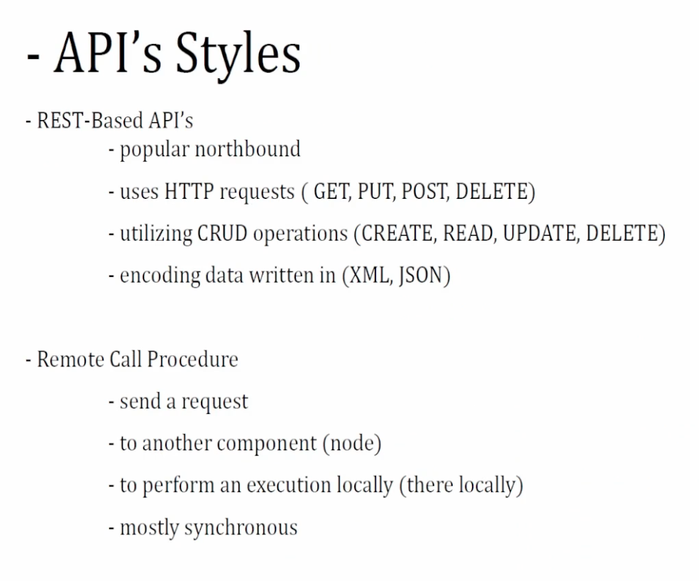

- [1.0 Network Programmability Foundation](#10-network-programmability-foundation)
  - [API](#api)
  - [Python](#python)
  - [Tools](#tools)
    - [long-running tasks](#long-running-tasks)
- [2.0 Automate APIs and Protocols](#20-automate-apis-and-protocols)
  - [YANG modules](#yang-modules)
    - [Example](#example)
    - [Resources](#resources)
- [3.0 Network Device Programmability](#30-network-device-programmability)

* from orhanergun @ udemy
  * https://github.com/OrhanErgun-net/OE_ENAUTO_300435

# 1.0 Network Programmability Foundation

## API

* 1.2 Describe characteristics of API styles (REST and RPC)
* 1.3 Describe the challenges encountered and patterns used when consuming APIs synchronously and asynchronously


* POST: CREATE
* PUT: UPDATE:replace
* PATCH: UPDATE:append


## Python

* [cheat notes](./python.md)

## Tools

* 1.6 Explain the benefits of using network configuration tools such as Ansible and Terraform for automating IOS XE platforms
* Ansible
  * Agent-less, Push, Procedural
  * More popular
* Puppet/Chef
  * Agent-based, Pull, Declarative

### long-running tasks

* Puppet (Agent-Based, Declarative Model)
  * Puppet operates on a pull-based model where agents periodically check in with the Puppet server.
  * If a task takes too long:
    * Puppet runs have a default timeout (e.g., 1800 seconds for an agent run).
    * If the timeout is exceeded, the agent run will fail, and Puppet will try again in the next scheduled run.
    * Long-running tasks should ideally be handled outside Puppet, using a system service or scheduled job (e.g., a systemd service or cron job).
    * Workarounds:
      * Use exec resources carefully with timeout parameters.
      * Offload long tasks to a separate background process.
* Ansible (Agentless, Push-Based Model)
  * Ansible executes tasks sequentially and synchronously by default.
  * If a task takes too long:
    * The SSH connection may time out (`ansible_ssh_timeout` setting).
    * If async and poll are not set, Ansible waits for task completion before proceeding.
    * Solutions:
      * `Async` Mode: Run tasks asynchronously using async and poll:
      ```yaml
      - name: Run a long task asynchronously
        command: /path/to/long_task.sh
        async: 3600   # Run for up to 1 hour
        poll: 10      # Check every 10 seconds
      ```
      * Fire and Forget: Set `poll: 0` to start the task but not wait for completion.
      * Check Status Later: Use `async_status` to check the task status later.

# 2.0 Automate APIs and Protocols

* 2.1 Identify the JSON instance based on a YANG model (including YANG Suite)
* 2.2 Identify the XML instance based on a YANG model (including YANG Suite)
* 2.3 Interpret a YANG module tree generated per RFC8340
* 2.4 Compare functionality, benefits, and uses of OpenConfig, IETF, and native YANG models
* 2.5 Compare functionality, benefits, and uses of NETCONF and RESTCONF
  * netconf: ssh port 830 (RFC 6242)

## YANG modules

* Data modeling = fillable forms at clinic
* RFC 8340
* github.com/YangModels/yang
* Tree Diagram
  * all elements are defined in the tree
    * nodes
      * leaf
      * list
      * leaf-list
    * containers
      * number of nodes
    * grouping
      * a set of elements
      * can be referred later
    * augmentations
      * insert new elements

### Example

```yang
module example-interface {
  namespace "urn:example:interface";
  prefix "intf";

  organization "Example Inc.";
  contact "support@example.com";
  description "A simple YANG model for network interfaces.";

  revision "2025-03-05" {
    description "Initial version";
  }

  container interfaces {
    list interface {
      key "name";
      
      leaf name {
        type string;
        description "Interface name (e.g., eth0, GigabitEthernet1)";
      }

      leaf enabled {
        type boolean;
        default "true";
        description "Enable or disable the interface.";
      }

      leaf ip-address {
        type string;
        description "IPv4 address assigned to the interface.";
      }
    }
  }
}
```

* REST API to config an interface

```json
PUT /restconf/data/interfaces/interface=GigabitEthernet1
Host: network-device.example.com
Content-Type: application/yang-data+json
Authorization: Bearer <your-token>

{
  "interface": {
    "name": "GigabitEthernet1",
    "enabled": true,
    "ip-address": "192.168.1.1"
  }
}
```

### Resources

* https://github.com/CiscoDevNet/yangsuite
* [YANG Suite - Cisco Learning Lab](https://developer.cisco.com/learning/labs/intro-yangsuite/introduction-launching-yang-suite/)
  * to load models, interact with elements, create RESTCONF urls, etc.
* https://www.yangcatalog.org/yang-search
  * search YANG models

# 3.0 Network Device Programmability

* 3.1 Implement device management and monitoring using NetMiko
* 3.2 Construct a Python script using ncclient that uses NETCONF to manage and monitor an IOS XE device
* 3.3 Configure device using RESTCONF API utilizing Python requests library
* 3.4 Utilize Ansible to configure an IOS XE device
* 3.5 Configure a subscription for model driven telemetry on an IOS XE device (CLI, NETCONF, and RESTCONF)
* 3.6 Compare publication and subscription telemetry models
  * 3.6.a Periodic / cadence
  * 3.6.b On-change
* 3.7 Describe the benefits and usage of telemetry data in troubleshooting the network
* 3.8 Describe Day 0 provisioning methods
  * 3.8.a iPXE
  * 3.8.b PnP
  * 3.8.c ZTP