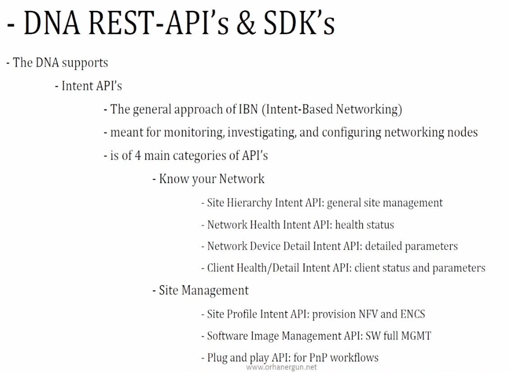
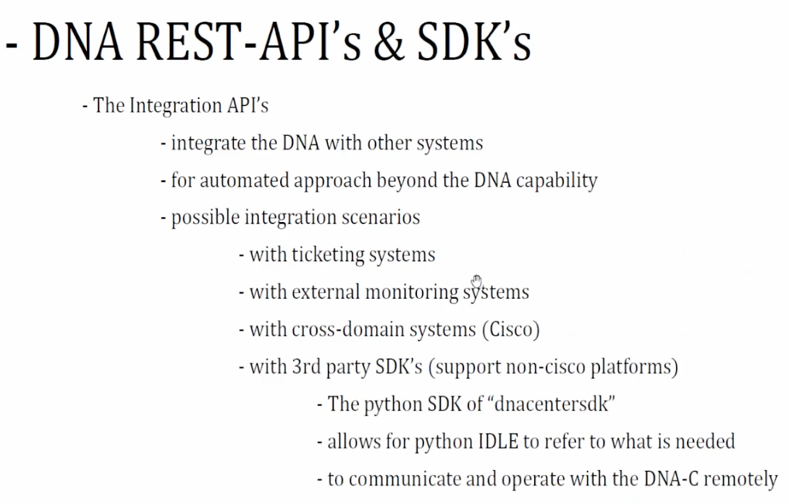
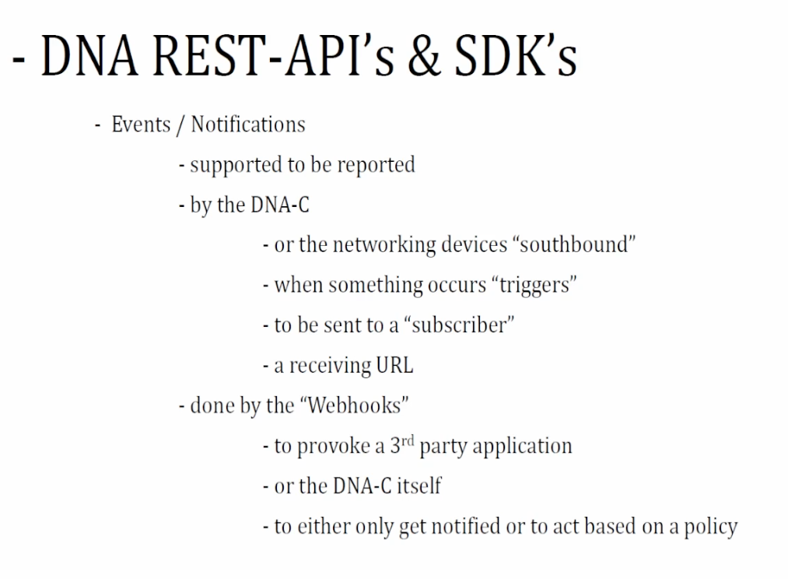

- [Resources](#resources)
- [Cisco DNA Center](#cisco-dna-center)
  - [Enterprise network / SDA](#enterprise-network--sda)
  - [API](#api)
  - [Webhook](#webhook)
- [Cisco SD-WAN](#cisco-sd-wan)
  - [SD-WAN Overview](#sd-wan-overview)
  - [Cisco SD-WAN Sandbox](#cisco-sd-wan-sandbox)
  - [APIs](#apis)
- [Cisco Meraki](#cisco-meraki)
  - [Overview](#overview)

# Resources

* [Cisco devnet free DNA Sandbox](https://developer.cisco.com/site/sandbox/)
  * virtualized DNA center is not available yet as of 2025
  * `devnetuser/Cisco123!`

# Cisco DNA Center

* [DNA Center Doc](https://developer.cisco.com/docs/dna-center/)

## Enterprise network / SDA

* 4.1 Compare traditional versus software-defined networks


* SDA:
  * study a book
  * LISP + VxLAN + SGT
  * onboarding new devices process etc
* DNA vs DNA-C
  * one DNA-C, many DNA models (small, large, XL)

## API

* 4.2 Describe the features and capabilities of Cisco DNA Center
  * 4.2.a Network assurance APIs
  * 4.2.b Intent APIs
  * 4.2.c Events and notifications
  * 4.2.d SDA





* 4.4 Implement API requests for Cisco DNA Center to accomplish network management tasks
  * 4.4.a Intent APIs
    * e.g. interface: 
      * https://sandboxdnac2.cisco.com/dna/intent/api/v1/interface
      * https://sandboxdnac2.cisco.com/dna/intent/api/v1/interface/network-device/9a28d450-ecb5-42b6-83ce-8f52f1e5252c/interface-name?name=GigabitEthernet1/0/1
  * 4.4.b Command Runner APIs
    * `dna/intent/api/v1/network-device-poller/cli/read-request`
  * 4.4.c Site APIs
    * `dna/intent/api/v1/site`
    * https://developer.cisco.com/docs/dna-center/2-3-5/get-site/
  * 4.4.d SDA APIs
* 4.5 Implement API requests for Cisco DNA Center to accomplish network management tasks using these APIs
  * 4.5.a Network discovery and device APIs
    * https://sandboxdnac2.cisco.com/dna/intent/api/v1/discovery/1/network-device
  * 4.5.b Template APIs (Apply a template)
    * https://sandboxdnac2.cisco.com/dna/intent/api/v1/template-programmer/template/ef63a2fb-ae75-47fb-b4fd-9ee362f2ceb8

<details>
<summary>a template example</summary>

```
!--- Crypto Config ---
crypto keyring keyring-dmvpn
  local-address $TunnelSource
  pre-shared-key address 0.0.0.0 0.0.0.0 key cisco
!
crypto isakmp policy 200
encr aes
authentication pre-share
group 2
lifetime 28800
crypto isakmp keepalive 10 10
crypto isakmp profile dmvpn
   keyring keyring-dmvpn
   match identity address 0.0.0.0
   local-address $TunnelSource
!
crypto ipsec security-association replay window-size 1024
!
crypto ipsec transform-set dmvpn esp-aes esp-sha-hmac
mode transport
!
!
crypto ipsec profile dmvpn-prof
set transform-set dmvpn
!
!--- DMVPN Tunnel Config ---
interface Loopback0
ip address $OspfRouterId 255.255.255.255
!
interface Tunnel0
ip address $TunnelIPAddress $TunnelSubnetMask
no ip redirects
ip mtu $mtu
!
ip nhrp map multicast $PublicIPCloudRouter1 !PUBLICIP OF CSR1
ip nhrp map $ActiveCloudRouterTunnelIP $PublicIPCloudRouter1
ip nhrp map multicast $PublicIPCloudRouter2 !PUBLICIP OF CSR2
ip nhrp map $StandbyCloudRouterTunnelIP $PublicIPCloudRouter2
ip nhrp network-id $NetworkId
ip nhrp nhs $ActiveCloudRouterTunnelIP
ip nhrp nhs $StandbyCloudRouterTunnelIP
ip tcp adjust-mss 1360
bfd interval 100 min
rx 100 multiplier 3
tunnel source $TunnelSource
tunnel mode gre multipoint
tunnel key $TunnelKey
tunnel protection ipsec profile dmvpn-prof
!
!--- BGP Config ---
router bgp $AutonomousSystemNumber
bgp log-neighbor-changes
neighbor $ActiveCloudRouterTunnelIP remote-as $NeighborBgpASNOfActiveCloudRouter
neighbor $ActiveCloudRouterTunnelIP fall-over bfd
neighbor $StandbyCloudRouterTunnelIP remote-as $NeighborBgpASNOfStandbyCloudRouter
neighbor $StandbyCloudRouterTunnelIP fall-over bfd
!
address-family ipv4
  network $OspfRouterId mask 255.255.255.255
  neighbor $ActiveCloudRouterTunnelIP activate
  neighbor $StandbyCloudRouterTunnelIP activate
exit-address-family
```
</details>

## Webhook

* 4.3 Implement Cisco DNA Center event outbound webhooks


* 4.6 Troubleshoot Cisco DNA Center automation process using Intent APIs

# Cisco SD-WAN

## SD-WAN Overview


## Cisco SD-WAN Sandbox 

* VPN is required to access reserved sandbox lab
  * to install old version of cisco anyconnect client on old iMac, check [here](https://vtcri.kayako.com/article/287-install-and-configure-the-cisco-anyconnect-software-vpn-on-a-mac)
  * also postman can be installed as [a VS code extension](https://marketplace.visualstudio.com/items?itemName=Postman.postman-for-vscode)


* tunnels

```
Tunnel Endpoints,Health,State,QoE,Avg. Latency (ms),Avg. Loss (%),Avg. Jitter (ms),Local IP,Remote IP
DC-cEdge01:mpls-Site1-cEdge01:mpls,green,Up,8.5,0.5,0.075,0,10.10.1.11,10.10.1.13
DC-cEdge01:mpls-Site1-cEdge01:public-internet,green,Up,8.5,1.5,0.075,0,10.10.1.11,10.10.1.13
DC-cEdge01:mpls-Site2-cEdge01:mpls,green,Up,10,0.333,0,0,10.10.1.11,10.10.1.15
DC-cEdge01:mpls-Site2-cEdge01:public-internet,green,Up,10,1.333,0,0,10.10.1.11,10.10.1.15
DC-cEdge01:mpls-Site3-cEdge01:mpls,green,Up,10,0.5,0,0,10.10.1.11,10.10.1.17
DC-cEdge01:mpls-Site3-cEdge02:public-internet,green,Up,10,2,0,0,10.10.1.11,10.10.1.18
DC-cEdge01:public-internet-Site1-cEdge01:mpls,red,Up,4.5,202.5,0.075,0.5,10.10.1.11,10.10.1.13
DC-cEdge01:public-internet-Site1-cEdge01:public-internet,red,Up,4,201.5,0.227,0.5,10.10.1.11,10.10.1.13
DC-cEdge01:public-internet-Site2-cEdge01:mpls,red,Up,3.667,202.333,0.15,0.333,10.10.1.11,10.10.1.15
DC-cEdge01:public-internet-Site2-cEdge01:public-internet,yellow,Up,5,201.333,0.05,0,10.10.1.11,10.10.1.15
DC-cEdge01:public-internet-Site3-cEdge01:mpls,red,Up,3.5,203,0.301,1,10.10.1.11,10.10.1.17
DC-cEdge01:public-internet-Site3-cEdge02:public-internet,red,Up,2.5,201.5,0.226,0.5,10.10.1.11,10.10.1.18
Site1-cEdge01:mpls-DC-cEdge01:mpls,green,Up,10,0.5,0,0,10.10.1.13,10.10.1.11
Site1-cEdge01:mpls-DC-cEdge01:public-internet,red,Up,4.5,203,0.075,1,10.10.1.13,10.10.1.11
Site1-cEdge01:mpls-Site2-cEdge01:mpls,green,Up,10,0.333,0,0,10.10.1.13,10.10.1.15
Site1-cEdge01:mpls-Site2-cEdge01:public-internet,green,Up,10,1.333,0,0,10.10.1.13,10.10.1.15
Site1-cEdge01:mpls-Site3-cEdge01:mpls,green,Up,10,0.5,0,0,10.10.1.13,10.10.1.17
Site1-cEdge01:mpls-Site3-cEdge02:public-internet,green,Up,10,2,0,0.5,10.10.1.13,10.10.1.18
Site1-cEdge01:public-internet-DC-cEdge01:mpls,green,Up,10,1.5,0,0.5,10.10.1.13,10.10.1.11
Site1-cEdge01:public-internet-DC-cEdge01:public-internet,red,Up,3,201.5,0.15,0.5,10.10.1.13,10.10.1.11
Site1-cEdge01:public-internet-Site2-cEdge01:mpls,green,Up,10,1.333,0,0,10.10.1.13,10.10.1.15
Site1-cEdge01:public-internet-Site2-cEdge01:public-internet,green,Up,10,0.333,0,0,10.10.1.13,10.10.1.15
Site1-cEdge01:public-internet-Site3-cEdge01:mpls,green,Up,10,1.5,0,0,10.10.1.13,10.10.1.17
Site1-cEdge01:public-internet-Site3-cEdge02:public-internet,green,Up,10,0.5,0,0,10.10.1.13,10.10.1.18
...
```

## APIs

* https://developer.cisco.com/docs/sdwan/
* https://github.com/suchandanreddy/sdwan-apis (examples)
* 5.1 Describe features and capabilities of Cisco SD-WAN vManage APIs
  

* 5.2 Implement a Python script to perform API requests for Cisco SD-WAN vManage Device Inventory APIs to retrieve and display data
  * `dataservice/device`
  * [example code](examples/sdwan.py)
* 5.3 Construct API requests for Cisco SD-WAN vManage Administration APIs
  * `dataservice/admin/user` GET and POST
* 5.4 Implement a Python script to perform API requests for Cisco SD-WAN vManage Configuration APIs to modify Cisco SD-WAN fabric configuration
* 5.5 Construct API requests for Cisco SD-WAN vManage Monitoring APIs (including real-time)
* 5.6 Troubleshoot a Cisco SD-WAN deployment using vManage APIs

# Cisco Meraki

## Overview

* Cisco Meraki is a suite of internet-managed network solutions that enables a single source of management over locations, infrastructure, and devices. Components include:
  * A complete cloud-managed IT solution.
  * Wireless, switching, security, mobile device management (MDM), and communications.
  * Integrated hardware, software, and cloud services.
* There are five ways an application can extend the Meraki platform functionality:
  * The Dashboard API, which provides a RESTful service for device provisioning, management, and monitoring.
  * Webhook alerts, a services that allows for real-time updates of network health and configuration
  * The Location Scanning API, an HTTP POST method configured on the Meraki Dashboard providing client location information (GPS, X/Y) based on Meraki Access Point (AP) map placement and client signal strength.
  * The External Captive Portal (EXCAP), which allows an organization to build out custom engagement models for devices leveraging their WiFi environment.
  * MV Sense, which offers a handful of REST API calls AND a real-time data stream to tap into the power of the MV12 camera series
  
  

* network hierarchy
  * org -> network -> device -> client

* 6.1 Describe features and capabilities of Cisco Meraki
  * 6.1.a Location Scanning APIs
  * 6.1.b MV Sense APIs
  * 6.1.c External Captive Portal APIs
  * 6.1.d WebHook Alert APIs
* 6.2 Create a network using Cisco Meraki APIs
* 6.3 Configure a network using Cisco Meraki APIs
* 6.4 Implement a Python script for Cisco Meraki Alert WebHooks

* [example](examples/cisco_meraki.py)