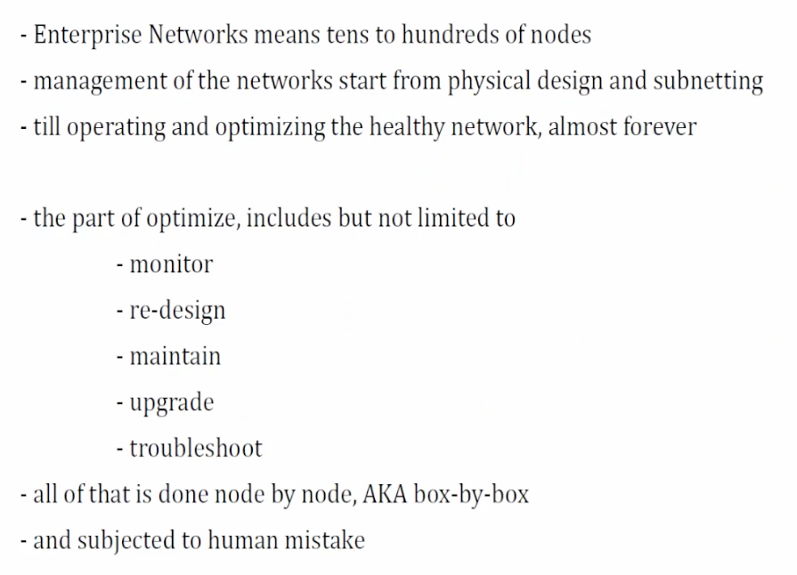
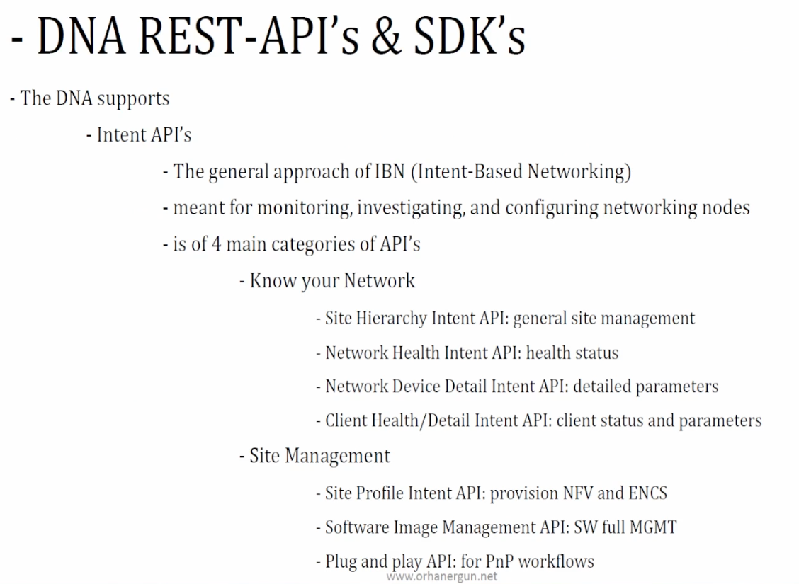
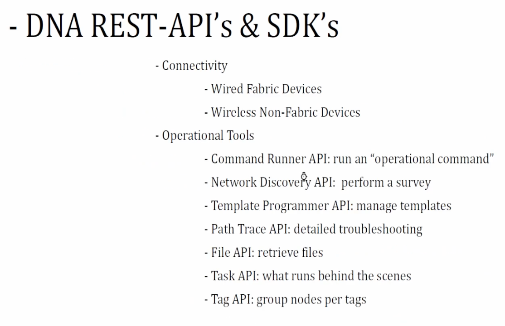
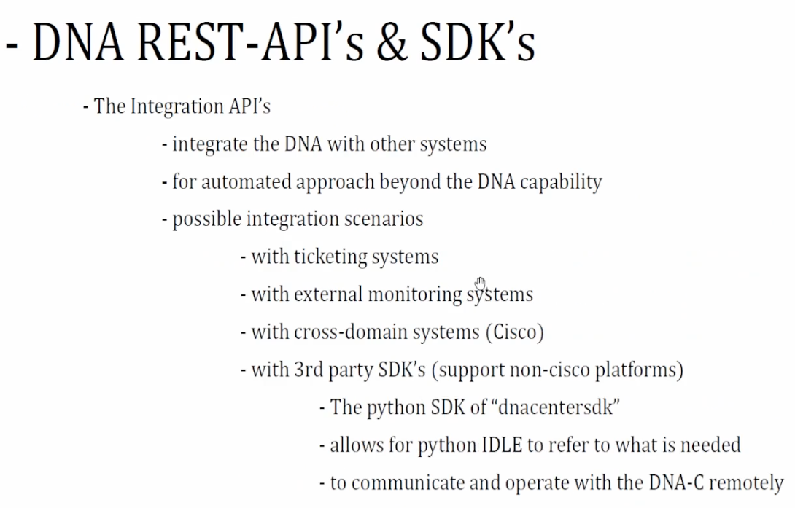

- [Lab resources](#lab-resources)
- [Enterprise network / SDA](#enterprise-network--sda)
- [API](#api)

# Lab resources

* virtualized DNA center is not available yet as of 2025
  * use cisco devnet free DNA [sandbox](https://developer.cisco.com/site/sandbox/)
* [DNA Center Doc, esp APIs](https://developer.cisco.com/docs/dna-center/)
  * devnetuser
  * Cisco123!

# Enterprise network / SDA

* 4.1 Compare traditional versus software-defined networks

* SDA:
  * study a book
  * LISP + VxLAN + SGT
  * onboarding new devices process etc
* DNA vs DNA-C
  * one DNA-C, many DNA models (small, large, XL)

# API

* 4.2 Describe the features and capabilities of Cisco DNA Center
  * 4.2.a Network assurance APIs
  * 4.2.b Intent APIs
  * 4.2.c Events and notifications
  * 4.2.d SDA

* 4.3 Implement Cisco DNA Center event outbound webhooks
* 4.4 Implement API requests for Cisco DNA Center to accomplish network management tasks
  * 4.4.a Intent APIs
  * 4.4.b Command Runner APIs
  * 4.4.c Site APIs
  * 4.4.d SDA APIs
* 4.5 Implement API requests for Cisco DNA Center to accomplish network management tasks using these APIs
  * 4.5.a Network discovery and device APIs
  * 4.5.b Template APIs (Apply a template)
* 4.6 Troubleshoot Cisco DNA Center automation process using Intent APIs
